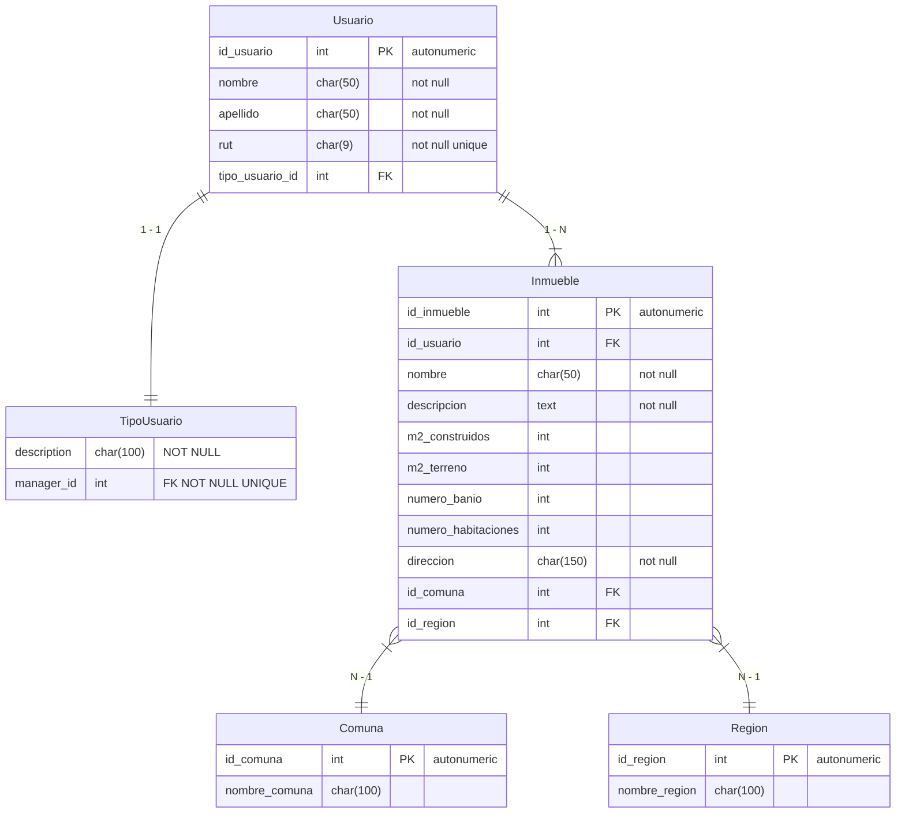

```mermaid
erDiagram
    Usuario {
        id_usuario int PK "autonumeric"
        nombre char(50) "not null"
		apellido char(50) "not null"
		rut char(9) "not null unique"
        tipo_usuario_id int FK
	}
	TipoUsuario {
		description char(100) "NOT NULL"
		manager_id int "FK NOT NULL UNIQUE"
	}
    Inmueble {
        id_inmueble int PK "autonumeric"
        id_usuario int FK
        nombre char(50) "not null"
        descripcion text "not null"
        m2_construidos int
        m2_terreno int
        numero_banio int
        numero_habitaciones int
        direccion char(150) "not null"
        id_comuna int FK
        id_region int FK
    }
    Comuna {
        id_comuna int PK "autonumeric"
        nombre_comuna char(100)
    }
    Region {
        id_region int PK "autonumeric"
        nombre_region char(100)
    }
	Usuario ||--|| TipoUsuario : "1 - 1"
    Usuario ||--|{ Inmueble : "1 - N"
    Inmueble }|--|| Comuna: "N - 1"
    Inmueble }|--|| Region: "N - 1"
```
